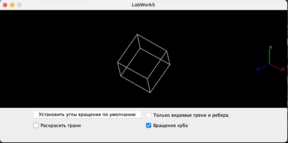

ComputerGraphicsLabWork5
========================

Задание на лабораторную работу 5:

Реализовать отображение куба с возможностью заполнения граней текстурой
и вращением куба, реализовать освещение.

Демонстрация работы:

